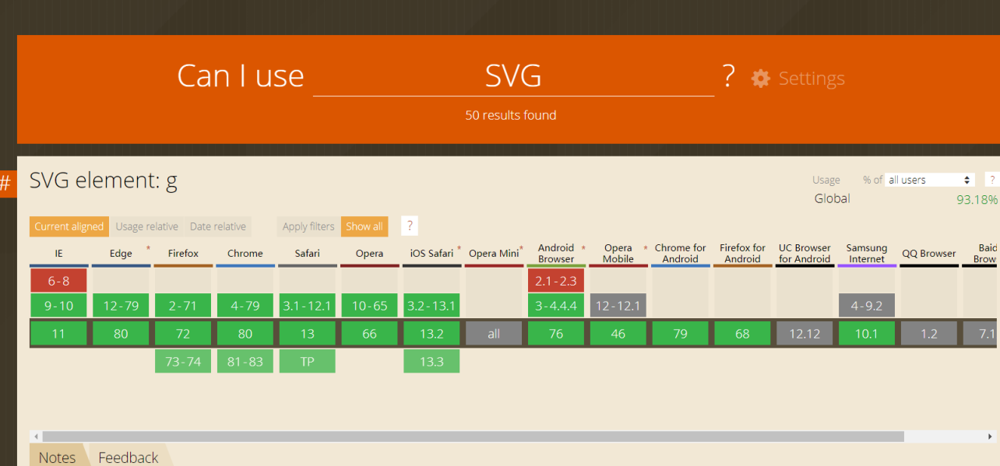

这章主要讲解如何利用开发工具做兼容调试，在这里不会具体讲浏览器之间存在哪些兼容问题，只分享自己了解到的一些导致浏览器兼容问题的原因和分享如何用调试台定位问题。

大多数数兼容问题都是因为浏览器不同、其次是终端不同，少部分是因为CPU和显卡等硬件不同导致，这个就比较少，不过也是有，好多年前遇到一个drop-shadow在不同的PC电脑上，同浏览器上渲染效果不一样，两台电脑都是公司开发机，唯一不同就是显卡。

兼容问题大多数都是寻找替代方案，同时也不是什么功能都能够兼容，有时一个合理友好的更换浏览器提示，可以大大的降低我们的兼容难度。所以在讲兼容之前，会先给大家讲兼容的范围。

在本章中处理兼容分为三个步骤：
- 确定兼容范围
- 确定前端语言支持性
- 排查兼容问题

市场上浏览器种类繁多，内核和内核版本也不相同，对前端语言的支持情况不一。不可能每一个浏览器都能兼容得好，在做兼容之前首先要确定的就是项目的兼容范围，其实就前端语言支持性，最后才是在项目中遇到兼容问题时，如何通过工具定位。

## 兼容范围

不论是项目新立项，或者是项目新人了解项目，都可以从下面三点去了解项目的兼容范围。一个是浏览器的市场占有率，二是浏览器版本差别、三是项目使用的主题框架支持的浏览器。

### 市场占有率

可以在[statCounter](https://gs.statcounter.com/)查看全球和各个国家地区浏览器每个时间段的使用占比。


有条件的公司可以在公司自己的数据系统中查看公司用户的使用情况，这个数据时最贴切的，不同的公司产品会有不同的受众，不同的受众在终端设备使用上会有较大的不同，比如如果是设计类产品，可能safari，chrome浏览器占比高，如果是大众类商品可能就260，QQ浏览器比较多，如果是公共类项目可以IE浏览器占比较高。

### 浏览器的版本

更新这个文档时是2020年，基本上不会像早几年那样不同版本的浏览器兼容性差别很多，以前国内浏览器起步晚，不同版本的浏览器之间内核版本差别较大，现在波动小很多，而且更加贴合chrome浏览器。

这里提供一些常用浏览器的旧版本下载入口

浏览器 | 下载链接 | 备注
-- | -- | --
chrome | [chrome浏览器旧版下载](https://www.slimjet.com/chrome/google-chrome-old-version.php) | 
Firefox | [Firefox旧版下载](http://ftp.mozilla.org/pub/firefox/releases/) | 
360 | [360旧版本下载](http://www.pc6.com/z/360llq/) | 不是很全面
QQ | [QQ浏览器旧版下载](https://www.xiazaiba.com/dl/23518.html) | 不是官网链接，安全性请自行评估
IE | [虚拟机](https://www.virtualbox.org/wiki/Downloads) | IE浏览器跟随window系统，无法单独下载，可以采用虚拟机安装旧系统

### 项目的主体框架

在先项目使用中，主体框架兼容性能，往往就限制兼容范围，比如Vue等大多数MVC框架就不兼容IE9以下。如果是使用SVG做图像编辑，那就需要慎重考虑IE浏览器，虽然SVG很早就立项，但IE至今还未完全支持。就像快图的编辑器，至今不支持全系IE浏览器。


进过这三步，确定好项目支持的范围，如无产品方面的变动，基本上落在确定好的范围内，我们会做兼容，范围外会统一出一个友好提示页，希望用户更新下载支持使用的浏览器，大大降低开发过程中的边际成本。

## 确定前端语言支持性

确定前端语言支持性这一步主要是在开发过程中先发现兼容问题，一般发生在开发前的技术评估阶段。

使用比较新的接口或者标签时需要先检查兼容性，一般我们会在[caniuse](https://caniuse.com/)这个网站中查看兼容。如果在存在不兼容我们兼容范围中的浏览器，就需要想兼容方案啦。

;

还有一个用于查看浏览器可支持性的网站[html5test](https://html5test.com/)

### 差异化处理

一般项目中会有一部分是用于组差异化处理，如CSS normalize、js handler、WASM的wasm2js等，先统一大方向对大部分不同浏览器之间的差异化做统一兼容处理。

现在，如果使用前端工程化构建的项目，在这一步花费时间会少很多，比如SCSS、Less可以默认处理样式前缀，使用postcss可以限定支持的浏览器和自动补全兼容代码。使用babel、polyfill，可以直接将JS，TS代码编译成兼容性好很多的ES5代码。

## 排查兼容问题

完成前面两部，剩下的就是漏网之鱼，当然漏网之鱼还是有很多，这小节也是符合我们chrome调试主题内容的，也就是如何在调试台定位兼容问题。

我把这部分兼容问题分成两部分，一部分是容易定位的，一部分是难以定位的。

容易定义的问题，主要是样式兼容问题、语法不支持问题。样式兼容问题可以对比两个不同浏览器，对应样式下的样式值。

举个例子，下面这个页面是国家软件考试的页面，就存在一个样式兼容问题。在同尺寸屏幕下，我们来看IE和Chrome下样式的区别

;
;

这里这是举个例子，两个浏览器兼容得都挺好，公共项目在IE浏览器兼容上是做得最好的。两张图片可以看出在同尺寸屏幕下，IE的内容宽度要比Chrome的窄。查看代码发现是@media不生效。查了一下@media的兼容，IE9以上就能够支持。这是再看头部<head>中的代码，发现有这样一个<meta>标签。也就是其实是固定使用的IE8的内核做渲染，所以@media不生效。

```html
<META http-equiv=X-UA-Compatible content=IE=8>
```
这个例子不是很贴切，毕竟业务就是限定兼容IE8，那这种已经算是兼容得很好。举这个例子主要是列举样式兼容的问题定位。

语法不支持的问题，也比较容易定义，一般在复现的浏览器上，看控制台报错就可以定位到问题。比如我们团队有一个小伙伴使用String.replaceAll()这个接口来替换字符串。这个接口的作用就是替换字符串中所有与之匹配的内容，相比于replace只能替换第一个匹配和大部分后端语言都有同等功能的接口，你会觉得这个接口的兼容性应该特别好，所以没做兼容性查询就直接用了。结果已上线发现一大堆报错，后来查了一下才发现这个接口的兼容性极差，即便是chrome也要85版本开始才支持。

;

类似的问题，其实很好解决。但兼容领人闻风丧胆的是剩下的难定位的问题，它出现的场景五花八门很难枚举。存在的可能性很多，比如获取DOM节点的值不同，如获取样式值默认值不同不同；具有相同功能但分属不同变量，如鼠标滚动方向；支持功能但不支持部分属性，获取到对象，但获取不到具体属性值；安全性问题，像打开窗口，Canvas像素编辑；资源加载问题等；排查这些问题只能用由内向外法，一层层的检测相关变量的值是否相同。

首先在出现问题的业务代码处，开始排查：
- 如果有想过的Dom节点的样式值获取，先看获取到的值是否一样
- 如果有事件相关的属性值获取，看获取到的值是否一样
- 在入口处打断点，查看业务代码运行的顺序是否一样
- 在入口处打断点，查看执行过程中调用的方法和变量是否一样，重要怀疑对应可以在watch中输出
- 根据这部分业务写一个demo，首先让这个demo在可兼容的浏览器正常输出，再在不兼容的浏览器下调试。缩写了范围基本上就可以定位到问题，或者也搜索问题的方向。

到此就是整个浏览器兼容的全过程。
