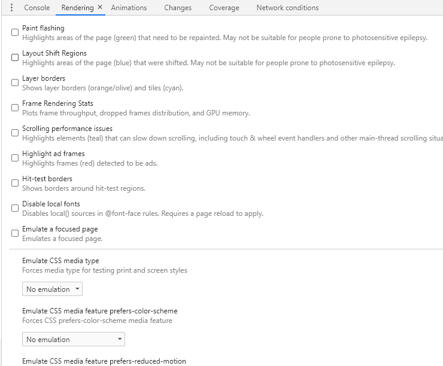
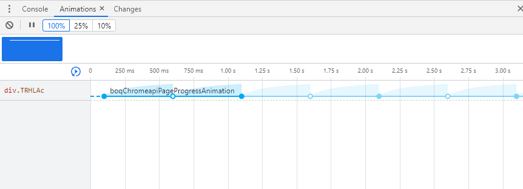
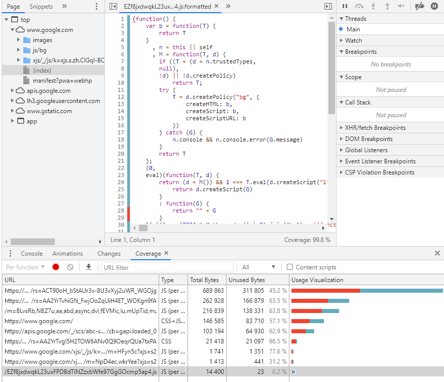
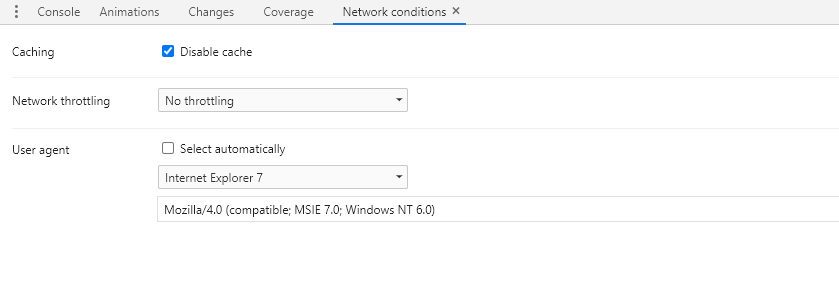
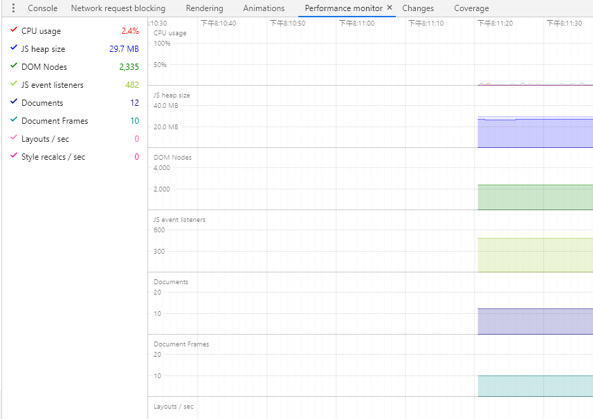
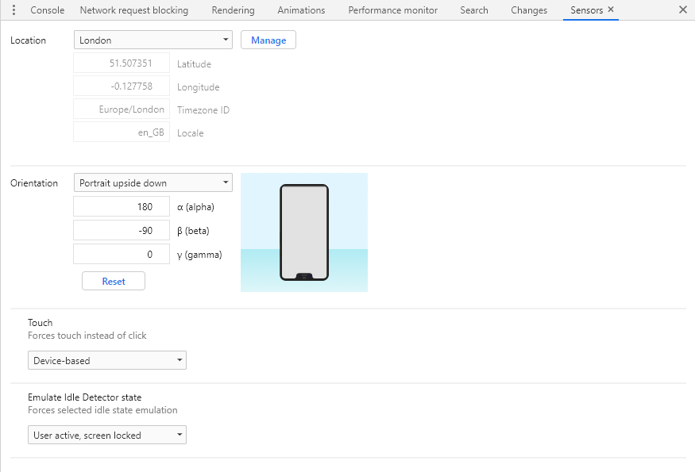

## 简介

Drawer在DevTools中极其常用的功能，它更像是一个小工具栏，起到对Panel面板的辅助作用。每个Drawer具备一个小功能，DevTools下大致有13个Drawer

## Console
功能和Panel中的功能一样，只是比较常用所以在Drawer中加多一个，方便和其他Panel协同使用。

## Rendering

### Paint flashing
在将要或者正被重绘的区域用绿色显示出来，可以用来查看页面渲染性能。

### Layout Shift Regions
节点发生改变的时候用蓝色显示出来。

### Layer borders
用橙色边框显示页面上图层。

### FPS mater
显示页面FPS，GPU绘制线程和内存的实时使用情况。以图表方式显示。

### Scrolling performance issues
用蓝绿色（看着像黄色）显示页面上哪些节点被阻止了滚动。

### Highlight ad frames
用红色显示页面哪些地方是广告。

### Hit-test borders
暂时不清楚用法

### Emulate CSS media
选择CSS媒体查询

## Animations
用于记录和查看页面上的动画。

从功能结构上看大概可以分为四部分

### 最上面的工具栏
最左边的图标，已经很清楚了，就是用来清除下面的记录的。
第二个图标是用来暂停动画执行的。点击暂停时，动画会停止在当前帧位置，页面静止。
最右边的100%，25%，10%是控制执行速度，比如选择25%后，动画执行速度是正常情况下的25%。

### 包含动画的层级
这里显示每一个包含有动画的图层，鼠标hover上去可以看到这个图层上的动画执行缩略图。可以切换选择不同图层，也可以删除。

### 动画展示和调试
展示图层下的动画，展示信息包括节点，动画执行时间，执行速率。可以拖拉红色竖线，查看每一帧的页面的情况。

## Request Blocking
用来拦截请求，在这里被拦截的请求将不会在站点中响应。

设置也比较简单，点击面板的“+”号->输入对应的链接或者正则->"add"既可以。取消拦截只需将链接前面的单选框取消选中即可。
在每一个链接的右边都会有编辑和删除入口。

## changes
这个面板的功能就比较简单，用来查看你在调试台上改了哪些代码，如下所示绿色代表新加，浅红色代表修改，红色代表删除。

## Coverage
Coverage的功能也是比较简单，是用来查看项目中有那些代码没被调用。红色部分就是没有被调用过的。在开发中不一定没有被调用的代码就意味着可以去掉，但能够标注出那些代码没有调用，可以方便我们做代码优化。

## Network Conditions
用来模拟网络状态。

### Cache
是否访问缓存

### 选择网络
可以选择Online（本机正常情况下网速），Fast 3G，Slow 3G，Offline（断网状态）。还可以自定义网速。

### 选择代理
其中的“select Automotically”是自动匹配浏览器的代理。取消选中后，可以在下面列表中选择你要在测试的代理。如果都不符合的话，可以选择“Custom...”然后在下面的输入框中填写目标浏览器的UserAgent。

## Performance monitor
以图表的方式实施显示浏览器的性能。包含有CPU的使用情况，内存，堆栈等等。

左边可以选择要显示的内容，右边是性能图片，横坐标是时间，纵坐标是各项性能指标。

## Search
用于搜索代码存在于那个文件中。有点类似于Network中的搜索。不同的是这里只能搜索代码。输入关键词或者输入正则表达式来匹配。搜索结果是一系列包含搜索词的文件列表，选择文件后，在Sources面板上打开对应文件。

## Sensors
用于模拟手机相关的感应器。
### 更改地理位置

这里可以直接选择城市，也可以输入经纬度来确定位置。浏览器只提供几个常用的城市，可以点击“Manage”按钮，在设置面板中添加新的位置。

### 更改陀螺仪倾斜度

Off是关闭陀螺仪不生效，选择Presets是一些常用的状态。选择Custom orientation可以在手机图片上自由拖拽来倾斜手机。

## WebAudio
查看页面中WebAudio的情况

## Remote Device
连接其他终端，用于在chrome上调试其他终端的页面。但目前大部分浏览器都连接不了，可能是出于安全考虑，所以这个面板可以忽略。

## What`s New
显示新版本中调试台更新了哪些功能。
