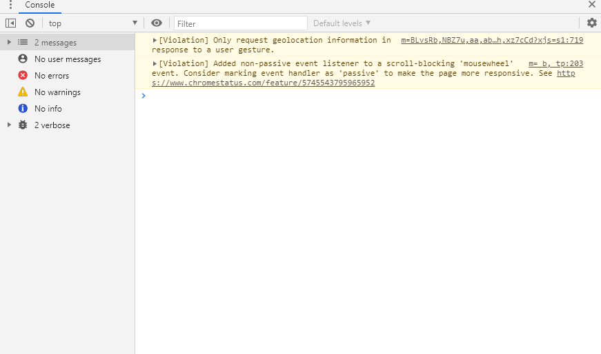
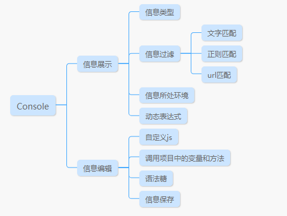
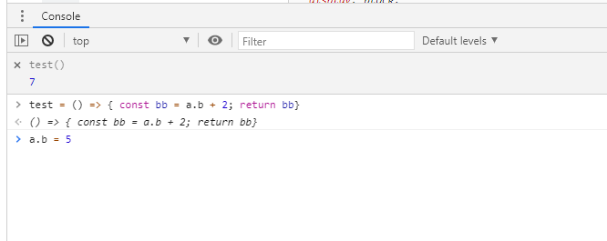

## 面板介绍

Console面板用于查看js执行时的输出（包括异常和警告）和执行js代码。是前端调试中最为常用的Tab之一

根据Console面板的功能分区，Console可以分成如下两大功能：

## 功能介绍

### 信息展示

**信息类型**

有两处地方可以查看信息类型，一个顶部最左边的箭头按钮，打开可以根据信息筛选，一个是“default levels”下拉框，同样可以筛选，只是前者单选后者可以多选，可以筛选的类型有普通输出，警告，异常和长数据输出。

**信息过滤**

“Filter”输入框可以对输出的信息进行过滤筛选，支持‘文字匹配’，‘正则匹配’，‘URL匹配’三种匹配方式，文字可以匹配输出内容和js的url名，正则匹配输出内容，URL匹配js的URL。

**信息所处环境**

点击“top”下拉框，可以选择不同域名下的输出，‘Top’表示整个项目下所有域名的输出

**动态表达式**

点击“小眼睛”图标按钮，可以打开绑定动态表达式输入框，根据需要写好绑定表达式之后，表达式关联的值发生变化，表达式的输出也同步发生变化。动态表达式，可以方便我们查看和调试某个方法的输出。比如下图代码，表达式绑定test()，方法中相关变量发生改变时，动态表达式输出同步变化。

### 信息编辑

**自定义JS代码**

可以在console控制台中编辑代码，比如变量定义和方法编写，如上图。只要没有语法错误，定义完按回车键就可以执行。如果是行数比较多的方法，建议在Sources面板中的Snippets中定义和执行，详细使用我们在Sources面板章节介绍。

**调用全局变量**

可以调用全局变量，全局变量包含Window下的默认变量和项目中的全局变量。

**语法糖**

提供了很多短小便捷的语法，方便我们调试中快速调用，下面提供几种，有兴趣的大家可以自行搜索。

- $ 用于搜索节点,$('div')类似于document.querySeletor('div')
- $$ 用于搜索所有节点，$$('div')类似于document.querySeletorAll('div');
- $0,$1,$2,$3 依次表示刚刚在Elements面板上最后选择的第一、二、三、四个元素
- $_ 表示上次运行的结果
- keys(obj)、values(obj) 返回一个数组，包含指定对象obj的key值或者value值
- copy 复制对象到粘贴板，可以用于复制比较难选的节点，或者直接复制输出结果
- 

**输出保存**

右击保存，可以将输出内容保存到本地，用于保存现场。

### 其他

其他功能主要是Console的一些设置功能，本身面板上有设置按钮，点击具有如下选项

- Hide network 忽略网络请求相关的输出
- Preserve log 刷新时不清空之前的输出
- Selected context only 只输出更项目相关的信息
- Group similar messages in console 将消息分组
- Log XMLHttpRequest 输出请求信息，每当有请求发出，相关的请求信息会在控制台输出
- Eager evaluation 不用按回车，甚至不用输出完即可看出输出值
- Autocomplete from history 还没琢磨明白
- Evaluate triggers user activation 还没琢磨明白

除此之外，在浏览器设置中还有其他两个设置项

- Preserve log upon navigation  还没琢磨明白
- Enable custom formatters 格式化用户输入的代码