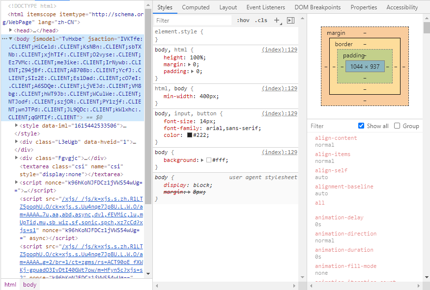
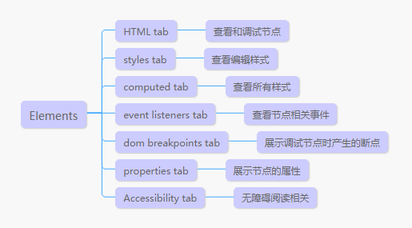
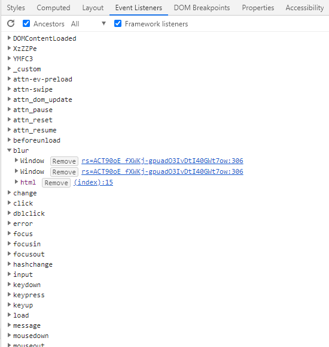

## 面板简介
Elements面板用于调试页面节点、样式；查看节点相关的事件、属性；节点断点，和无障碍阅读相关调试。是前端调试中最常用的Tab之一。

根据Elements面板的功能分区，Elements可以分成如下七个功能：

## 子功能介绍

### HTML Tab

用于展示和调试节点，右键菜单具有很多方便开发者使用的快捷功能，右键菜单的功能可以说就是这个Tab所具备的功能

- Add attribute 在选中节点上添加新属性
- Edit attribute 在选中节点上修改属性，所修改属性为鼠标指向的属性
- Edit as HTML 编辑选中的HTML
- Copy 复制节点相关内容，包括复制元素，索引，JS选择器，XPath等
- Hide element 隐藏元素，将元素从页面中隐藏，等同于设置了visibility：hidden
- Force state 触发选中元素的某种状态，如:active,:focus,:hover等
- Break on 给选中元素打断点，元素发生改变时，在触发改变的位置中断，断点分类三类，一个是元素属性发生变化；一类是元素被删除，一类是元素子元素发生变化。
- Expand recursively 展开元素的所有子元素
- Collapse children 闭合选择元素
- Capture node screenshot 将选中元素生成节点并下载
- Scroll into view 将选中元素滚动到可视区域中间
- Focus 快速触发focus状态
- Store as global veriable 将元素的Dom对象存储在一个临时变量，并定义和输出在console面板

### Styles Tab

用于查看和编辑选中节点样式，提供多种方便开发定位的查看方式和一些快速编辑样式的功能，主要功能可以归结为下面几类

- 查看样式 可以直观查看样式，左边样式表，右边对应样式文件和位置，从上到下排列，越上面优先级越高，排在下面标有inherit from 的样式为继承样式，最后面为相关伪类样式（如：after，：before等）。带黑色横向为无效样式，颜色浅灰为被覆盖样式。
- 过滤 顶部“Filter”输入框可以搜索样式和样式索引，方便我们排查和定位
- 编辑样式 在样式表上点击可以编辑样式、样式索引，点击".cls"可以删除或添加节点的class。同时提供一些便捷操作工具，如颜色选择和动画贝塞尔曲线设置，方便开发调试。
- 触发状态 一些触发状态交互，可以直接在面板触发，比如:hover。点击“：hov”选择即可设置和触发
- 添加样式所以 点击“+”号，自动添加一个行外优先级最高的索引

### Computed Tab

也是用于查看样式，不同之处在于，这里可以查看所有样式包括浏览器默认样式。不同浏览器或者不同版本浏览器的默认样式可能不同，该面板可以用于调试样式兼容问题。功能比较简单，主要是查看，配置一些简单设置，用来过滤单独展示在项目中定义的样式，主要设置如下：

- Show all 显示所有样式
- Group 样式根据功能做分组，方便查看
- Filter 过滤选择某些属性

### Event Listeners Tab

用于查看选择节点的事件，包括自身绑定的事件、全局事件、冒泡触发到的父元素事件。在开发中可以用于查看关联的事件，也可以在Tab删除事件。

查看事件，点击取消选中“ancestor”，显示直接绑定在当前节点的事件，点击取消选中“Framework listener”过滤定义在插件中的事件。“all”下拉框可以用来筛选冒泡阶段和捕获阶段的事件。

点击事件名，展开所绑定事件，鼠标hover上去可以看到事件名傍边有个“remove”按钮，点击可以删除绑定。可以用于定位排查事件交互的bug，比如点击节点报错，不清楚是在mousedown还是mouseup还是click中触发的话，可以一个个删除排查。

### Properties Tab

展示选中的节点的一些Dom属性，查看包含的属性支持的事件的

### DOM bleakpoints

用于管理调试时打的Dom断点，可以暂停触发，也可以删除，功能比较单一

### Accessibility Tab

用于调试和查看页面的无障碍阅读功能，比如对盲、聋人士的支持。

### 其他

除此之外还可以在调试台的设置中打开某些配置功能，点击设置，选择preference，查看Elements设置项，可以设置的功能选项如下

- Show rulers 在页面捕获节点时，显示对齐线
- Show user agent shadow DOM 显示影子节点
- Word wrap 自动换行
- Show HTML comments 是否在页面中显示被注释的HTML节点
- Reveal DOM node on hover 在页面捕获节点时，鼠标hover在元素上时，则在HTML tab中显示对应节点，如果关闭则要点击才可以显示
- Show detail inspect tootip 在页面捕获节点时，显示元素的size等详细信息

以上就是Elements面板的功能