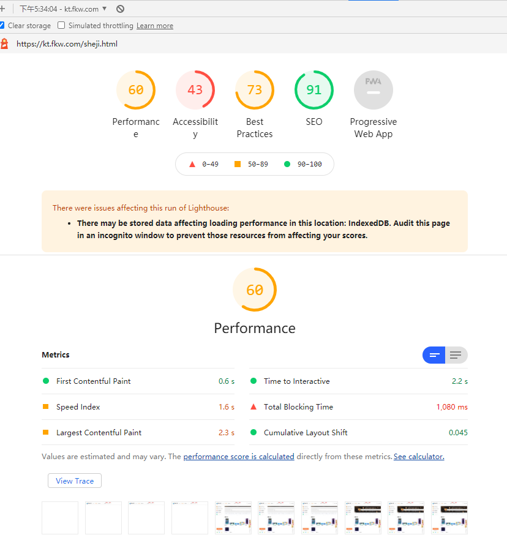

## 面板介绍

LightHouse在旧版本中Audits，用来做页面可用性评估的。从前几个版本的chrome浏览器开始，采用的是lighthouse插件做评估，新版的面板干脆就叫做Lighthouse。主要用于做页面可用性评估。也是在做页面性能评估时常用的面板

Lighthouse操作比较简单，主要的工作也是手机如下五类的数据

## 功能介绍

### 设置

选择你要评估的类型，比如如果你不想评估无障碍阅读相关的可以取消选中，再选中你要评估的终端，选择Mobile或者Desktop。设置完成后点击“Generate report”生成评估报告，报告如下

### Performance 评估

报告中的页面前端性能部分的评估，包含指标和一些诊断结果，也就是列举一些导致你性能分丢失的原因

**指标**
- First contentful Paint 首次内容渲染
- Time to Interactive 首次可以交互，但页面事件绑定完成时可以简单这么理解
- Speed Index 速度指标，这个是一个参照指标，值越低越好，可以理解为页面的一个平局相应值
- Largest contentful Paint 页面稳定后，总的渲染时间
- ... 其他的一些类型标志性能的指标

这些都是一些估算值，且可能因时而已，可以用于做性能评估，但无法准确确定性能，实际性能还是得通过公司总体用户使用时做的性能统计，更为准确。所以下面还会提供一些诊断结果

**诊断结果**

红色代表存在可优化空间的，不太符合预期的，灰色代表建议尝试去优化的，绿色代表做得好，符合预期的。一般点击不符合项会展开显示需要修改的代码位置。这些条项也可以作为性能优化的指标。

### SEO 评估

评估页面的SEO可用性，同样也是罗列出页面在存在的不足和做得好的条项

### Best Practices 符合最佳实践

浏览器开发商收集的一些针对前端开发的最佳实践规范，包括安全性，也包括性能。评估最佳实践就是看看页面中符合了那些条项，违反了哪些条项。

### 无障碍阅读

跟无障碍阅读相关

### PWA PWA评估

跟PWA相关评估