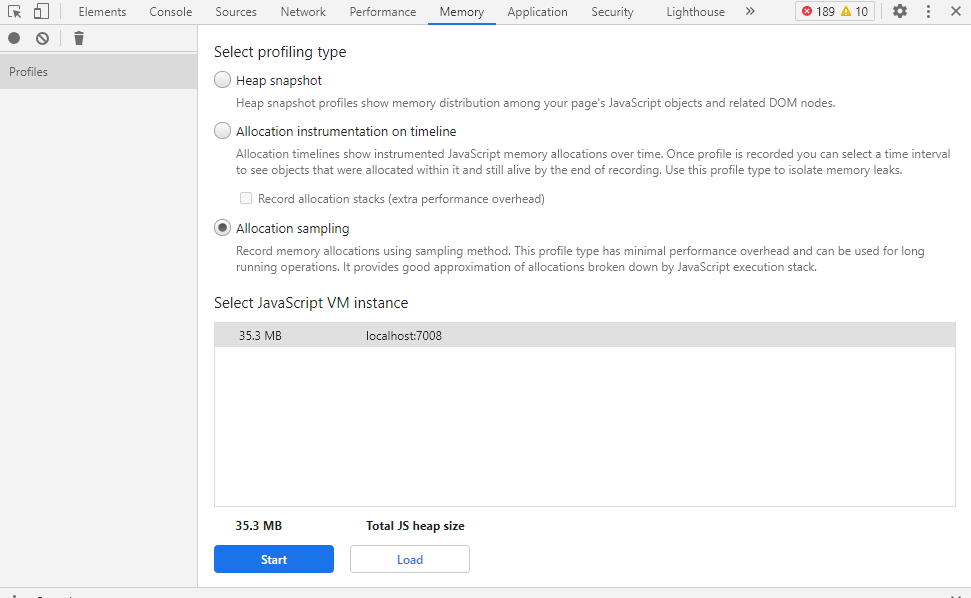

## 面板介绍

Memory用于记录页面内存的使用情况，其实可以在Performance面板上查看，平时用得比较少，主要用于分析内存，对比排查导致内存上升的插座，和定位内存泄露问题。

功能比较简单主要是提供三种方式来收集页面内存的占用情况，点击选择任意一种，点击start开始运行，并收集性能数据。

## 功能介绍

### Heap profiling type

通过堆栈快照，来显示页面的内存占用情况，收到到内存使用数据之后，按照不同的视图展示给开发者。视图如下：

- Summary 按照构造函数进行分组，用于捕获对象和它们使用的内存情况，对于跟踪定位DOM节点的内存泄露特别有用
- Comparison 对比两个快照的差别，用于对比某个操作前后，内存快照。分析操作前后的内存释放或者占用情况
- Containment 分析对象的引用情况，有助于分析闭包和进行更深层次的对象分析
- Statistics 视图统计

### Allocation instrumentation on timeline

按时间轴记录内存使用信息，跟上面一种异样，具有多种展示视图

### Allocation sampling

收集每个方法占用的内存