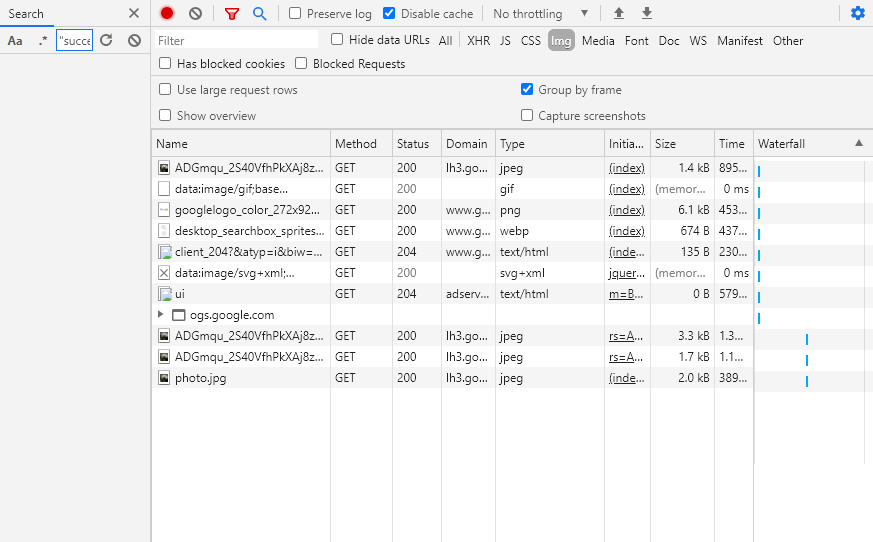
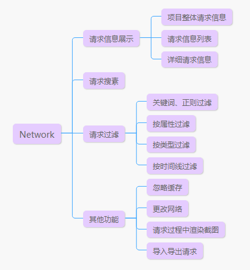
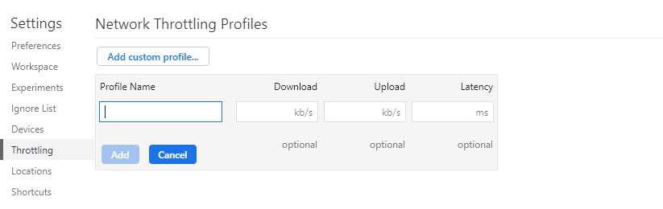

## 面板介绍

Network主要用于查看请求状态，请求返回数据，调用情况等，是前端调试中最为常用的Tab之一

根据Network面板的功能分区，Network可以分成如下四大功能：

## 功能介绍

### 请求信息展示

Network面板的主要展示区，可以查看项目某阶段总体请求情况，查看每个请求的Header，Priview，Response等，可以定位到请求触发的代码位置。信息大致可以分为下面几部分

**总信息**

最底部的部分，从左到右依次表示，请求总数、通过网路获取数据、总容量、全部加载时间、dom加载时间、网络请求时间。每个数据用“/”符号分成前后两部分，前面是选中的的类型或者时间段下的数量，后面是总数量

**请求列表**

请求列表，展示的是每个请求相关内容，表格按请求内容分列显示，在列表头部右键可以添加或者删除列，显示其他请求内容，比如methods，显示请求方法。

这个列表有两个比较常用，一个是initiator，记录请求被调用的位置和调用堆栈。一个是waterfall，用于查看请求发出的时间点，和请求过程各个环节的时间占比，默认是按waterfall排序

**请求详细信息**

- Header 请求头部信息，包括所带的参数，cookie，参数数据类型，返回数据类型，refer等
- Priview 返回信息的预览，一般img会显示图片，js、css只显示代码，ajax请求显示对象，html显示页面渲染后的节点（不带样式）
- Response 返回信息的数据，一般img是二进制流看不到，js，css，html是文本，xhr大多数是文本
- Initiator 跟列表的Initiator一样
- Cookies 每个请求相关的Cookie
- Timing 跟Waterfall一样

### 请求搜索

点击面板顶部的“放大镜”图标按钮，打开搜索栏，输入想要搜索的内容即可搜索。可以搜索到请求名字，也可以搜索详细请求信息中的内容，如参数和返回。用来搜索信息再合适不过。

### 请求过滤

请求的种类很多，比如图片，xhr，js等，即便是图片也很多格式，同时还要分区不同的域名下。这些在Network这个面板下都可以区分，具有较强的过滤功能，可以按关键词过滤，按属性过滤，按类型过滤，按时间段过滤。

**关键词过滤**

在“Filter”输入框输入关键词，或者正则表达式，可以按请求url做匹配，匹配出符合的请求

**类型过滤**
“Filter”输入框后面一行属性词，可以根据请求类型，过滤显示某种类型的请求

**按类型属性**

同样还是“Filter”输入框，先输入要过滤的类型属性，在输入“：”后加上搜索关键词，即可按属性搜索，比如domain：www.baidu.com搜索属于baidu这个域名下的所有请求。支持的类型词如下。

- domain 筛选指定域名下的资源，可以使用通配符（*）比如*.com 显示所有以结尾的域名的资源.com。
- has-response-header 显示包含指定的HTTP响应标头的资源。
- is 用于筛选某种状态下的资源比如is:running可以找到websocket资源，is:from-cache，可以筛选直接从缓存中获取的资源。
- larger-than 按资源大小来筛选，大于指定大小的资源。
- method 按请求方式筛选，如GET或者POST。
- mime-type 按文件格式搜索，比如搜索gif格式的图片mime-type:gif。
- mixed-content 显示所有混合内容资源（mixed-content:all）或仅显示当前显示的资源（mixed-content:displayed）。
- scheme 显示通过不受保护的HTTP（scheme:http）或受保护的HTTPS（scheme:https）检索的资源。
- set-cookie-domain 按域名搜索，并且该域名资源有set cookie。
- set-cookie-name 按cookie筛选，筛选出带有某个cookie的资源，匹配以cookie名字匹配。
- set-cookie-value 按cookie筛选，筛选出带有某个cookie的资源，匹配以cookie值匹配。
- status-code 按请求状态筛选，比如筛选请求状态为404的请求。

### 其他

除了这些之外，还有一些小工具功能，比如模拟网络状态，忽略缓存等，同样也和其他功能面板一样具有一些设置功能

**忽略缓存**

点击“diabled cache”每次请求时都直接从服务器请求数据，忽略浏览器本地缓存

**模拟网络状态**

提供“online”，“offline”两个网络开发，和“slow 3G”，“fast 3G”两个不同的网络速度。也可以点击“custom”去设置面板中自己定义网络状态，设置好上下行和延迟，点击“ADD”就可以见状态添加到Network面板中。

**其他设置功能**

面板中的设置

- Use large request rows 请求列表使用大图标
- Show overview 显示请求时间线
- Group by frame 根据iframe做分组
- Capture screenshots 显示请求过程中，页面视图截图

调试台中的设置

- Preserve log 属性时不清楚之前请求
- Record network log 是否记录请求日志，关闭后将不记录请求数据
- Enable network request bloking 
- Disable cache(while DevTools is Open) 忽略缓存，跟面板的设置同步
- Force ad bloking on this site 强行阻止广告显示
- Color-code resource types 用不同颜色区分不同类型的请求，在waterfall下可以看出区别
- Group network log by frame 根据iframe做分组
