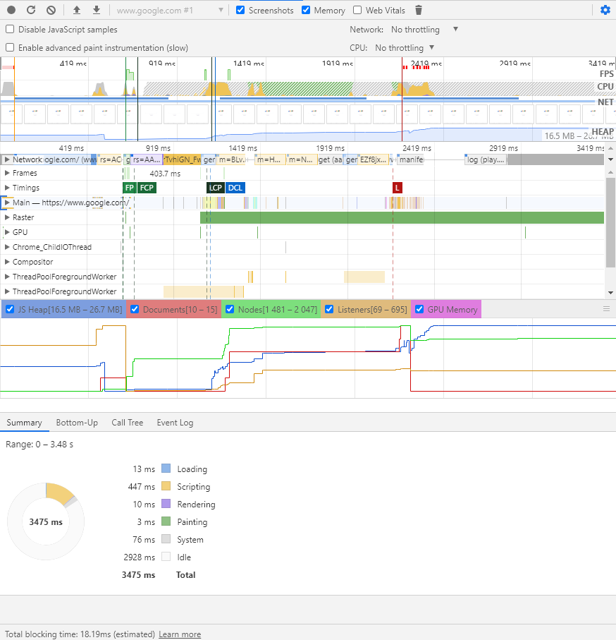
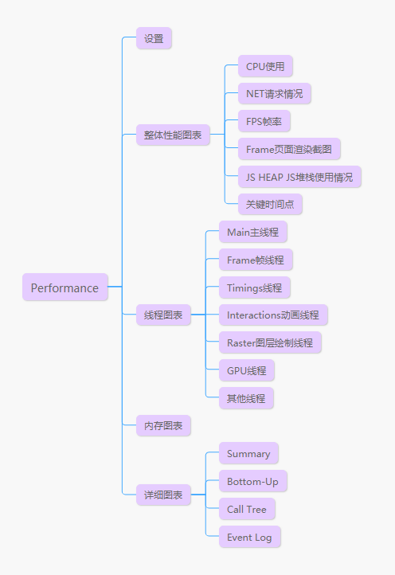
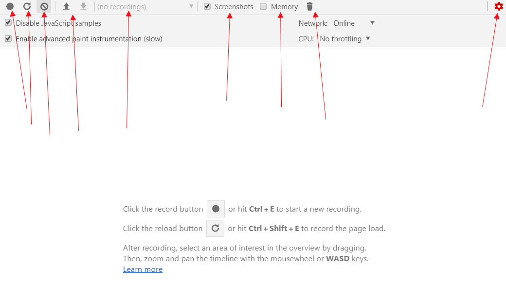

## 面板介绍

Performance面板主要用于查看页面性能，查看页面各个状态的时间，和资源的占用情况。一般在做性能调试的时候会常用到，功能非常多，也非常强大。

根据Performance面板的功能分区，Performance可以分成如下五部分

## 功能介绍

### 性能收集设置

开发Performance后不会显示任何收据，需要点击收集按钮，重新开始收集，或者选择之前已经收集的数据。

收集性能时，可以点击收集页面交互时的性能，也可以重新加载收集性能。点击“设置”可以设置网络状态，CPU使用线程数等。

如上图从左到右的功能分别为

- 记录运行时性能，页面不会重新加载
- 记录负载时性能，页面重新加载并开始记录性能
- 清除所有性能记录
- 导入导出性能文件
- 在这里选择之前保存的记录
- 在性能信息中显示页面截图
- 在性能信息中显示内存信息
- 强制垃圾收集
- 设置
    - Disable JavaScript sample：在性能信息记录中禁用对js调用堆栈的记录
    - Enable advanced paint instrumentation（slow）：在性能详情中显示Layer tab。
    - network 跟Newwork Panel中的一样，用于更改网络网速
    - CPU 更改CPU性能，比如可以选择比你当前电脑慢4倍的性能来调试

### 整体性能图表

面板的最上面图标为整体性能图标，该表主要显示收集过程中各种资源的使用情况。大概可以收集到下面这些性能

- FPS 页面帧率，颜色为绿色为正常，绿色越深帧率越高，红色为卡顿，颜色越深帧率越低，越卡顿
- CPU CPU使用情况，这一条如果被充满，说明CPU一直存于高负荷状态，灰色或者白色代表空闲，不同颜色代码不同的业务逻辑占用情况
- NET 请求数，如果用蓝色色条表示，长度表示时间，长度跨度越长，代表请求时间越长
- 页面截图 每个时间段页面截图
- JS HEAP JS占用的内存
- 关键时间线 图标上的一些纵向线，标志各个关键节点的时间值，如FCP，DCL等

### 线程图表

接下来就是行程图片，可以看到业务调用了那些线程，点击线程可以可以在内存图表查看内存的使用情况。一般常看的还是JS主线程的数据，也就是Main线程。打开线程，下面有不同颜色的矩形块组成，不同颜色代表不同类型的操作占用，比如黄色代表js执行，矩形长度越长，占用的时间越长，纵向越深，说明嵌套的越多。一般如果性能太差会在矩形块的右上角标一个红色三角形

### 内存图表

点击某个线程，会在线程表下面显示内存的使用情况，包括

- JS heap JS堆栈占用的内存
- Document 文档数
- Nodes 节点数
- Listener 时间数
- GPU GPU占用内存

### 详细图表

详细图表在最下方，根据你选择的时间段，线程，执行位置不同，显示你所选择的部分的执行时间和各个类型的执行时间

Summary 一个饼状图，统计各个类型的执行时间
Bottom-up 根据每一个功能做分类，列举每个功能的时间，self time为自身执行时间，total time为算上调用的总时间。
Call Tree 根据调用数。统计每一个调用的执行时间
Event Log 列出每个详细事件的执行时间