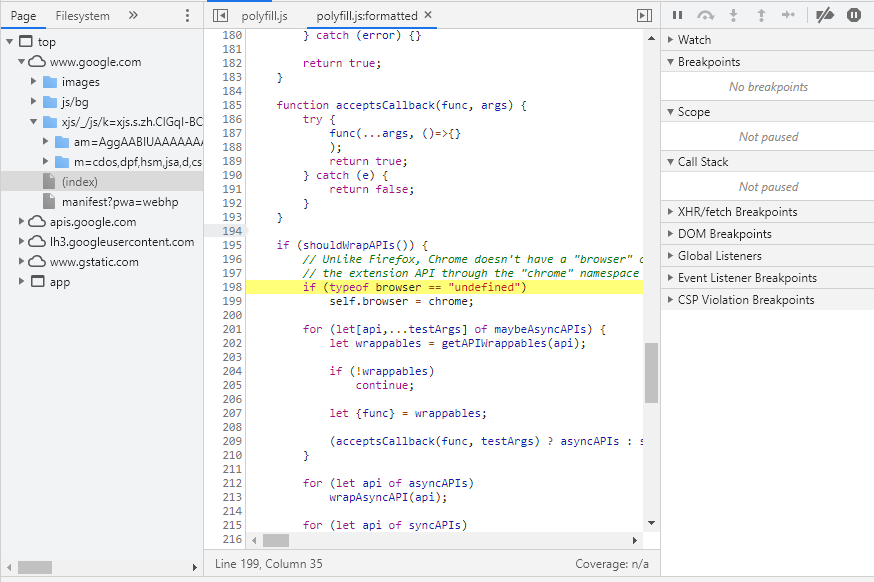
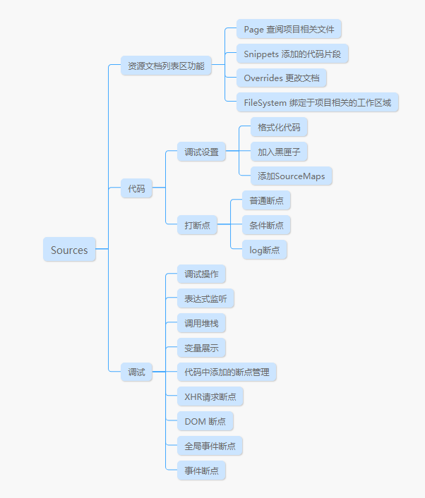
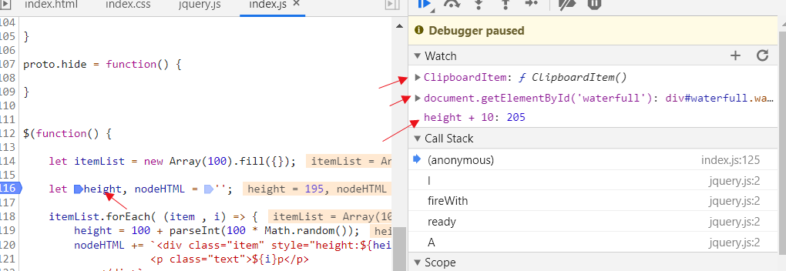

## 面板介绍

Sources查看项目代码，调试JS和编写一些简单脚本，也是前端调试最常用的Tab之一，面板功能也比较多。

根据Network面板的功能分区，Network可以分成如下三大功能：

## 功能介绍

### 资源文档区功能

在面板的左边区域就是资源文档列表区，根据功能和所属访问不同分成Pages,Snippets,Overrides,FileSystems这四类，各自功能分别如下。

**Pages**

项目相关的资源文字，按域名做分组，根据访问的页面的目录结构按域名分组，显示项目的资源文件。

**Snippets**

代码片段，代码片段是开发者自定义在浏览器中的代码，这些代码可以直接在浏览器上运行，可以用于调试比较长的代码，也可以运行Demo，或者跑脚本都可以。存储在浏览器内，一旦定义可以在任何页面下运行，关闭浏览器也不会删除。

在Snippets面板下，添加一个新的js文件，命名完成之后，既可以在代码区域编辑代码，可以定义方法，也可以调用当前页面的全局变量。定义完成后，可以在Console中调用，也可以直接调用运行，完成后，点击代码区右下角的运行按钮即可运行。

**Overrides**
打开项目相关的一个本地文件进行编辑，并可以保存到本地

**FileSystem**

打开一个项目相关的文件夹，进行编辑和运行，并可以保存到本地

这两个功能合并在一起，就有点想小程序开发者工具，既可以编辑也可以调试。但考虑到性能和安全性，平时用得不多，加之现在前端工程化具有的热更新，在其他编辑器编辑后，再来浏览器看效果的开发效率也不出。所以这两个功能就不在做详细讲解

### 代码区功能

面板的中间区域，即为代码区，主要功能是展示和编辑代码，和做一些调试设置

**调试设置**

在代码区右键，右键菜单具有几项快捷功能，大多数直接看就知道功能

- Add sourcemap 添加sourceMap，在打开的输入框中输入可以访问的SourceMap地址，即可添加
- Add script into ignore list 在调试时忽略该脚本中的执行，比如在业务代码中打断点，一层层执行后，通常会执行到插件中的逻辑，如果你不需要调试某个插件中的逻辑，可以将该插件添加到ignore list，下次调试就不会执行到插件中
- 格式化代码 一般线上代码时被压缩的，点击代码区的左下角可以格式化代码，按ctrl+g 输入行列号可以定位到对于行列的代码上，一般我们在排查系统捕获到的异常时，异常信息中一定会有触发代码的行列号，这样方便定位。

代码区还可以编辑代码，编辑后执行到编辑处时，会执行我们编辑的代码，也就是可以直接编辑调试。但是由于现在工程化，不论是开发环境还是线上环境都有一定程度的压缩和编译，所以直接在代码区修改代码在现阶段的可用性不高，这里也不做详细讲解。

**打断点**

打断点的功能比较简单，在代码的行号上直接点击或者右键选择断点类型即可打断点。断点可以分成三种类型，分别为：

- 普通断点 代码执行到打点处中断，并可在代码区查看相关变量的值
- 条件断点 代码执行到打点处，如果打点处的打点条件成立（表达式的返回为true）即可触发断点。否则不触发
- 输出断点 代码执行到打点出，以log的形式，将结果输出到Console面板，但程序不中断。

通常普通断点打得多，用于查看程序运行过程中各个变量值和值的变化、运行顺序等。条件断点用得最少，最要用于关联方法外的值；输出点断则是用在循环当中做输出，避免重复浪费太多时间。

### 调试区

最右边为调试区，调试区的功能也非常多，大致可以分成如下几部分。

**执行调试操作**

在调试区的最上边的一些图标按钮，当断点被激活同时程序被中断时，这些按钮被激活，与我们F9，F10快捷键相对应。这些按钮的功能如下：

- Resume 继续调试下一个断点
- Step Over 执行完当前行代码，并跳到下一行暂停
- Step In 如果当前行是调用函数，则跳入到该函数内，并暂停在第一行
- Step Out 通过Step In进入后，在函数内执行完函数剩余代码，跳出函数，并在下一行暂停
- Deactivate breakpoints 暂停所有断点，不会移除断点。
- Pause on exceptions 发生异常时，在异常抛出处自动断点并暂停。下面会有一个Pause on caught exceptions，这个是是否要在被项目代码catch的位置中断

**监听变量-Watch**

点击Watch左边的“+”号，可以添加监听对象，可以是一个变量、表达式、设置时一些全局接口。

**调用堆栈-Call Stack**

断点激活时，可以看到断点函数的调用堆栈，蓝色箭头为当前执行位置，同时在堆栈的每个函数上右键，可以选择“Restart frame”重新执行该方法，一般如果在调试过程中有修改代码，即可这样重新执行一次，无需刷新

**相关变量-Scope**
断点激活时，记录不同作用域下，包含的变量的值。包括下面几种变量，这几种变量跟JS变量作用域的定义相关，比较底层，可能总结的不是很好。

- Local 属于断点所在代码块的变量
- Closure 闭包中更改过的变量
- Script 全局变量中let定义的变量。
- Global 全局变量。

**JS断点-Breakpoints**

记录和管理断点，可以暂停也可以删除

**请求断点-XHR/fetch Brackpoints**

点击右角的“+”号即可添加请求断点，点断在请求发出时被触发，定位到请求被发出的js位置上。通常在业务代码不熟悉的情况下，可用来查看代码时在哪里触发的。

**节点断点-Dom Breakpoints**

在Elements面板上打的断点，主要也是用于管理断点，可以暂停也可以删除

**全局事件-Global Listeners**

页面所有的全局事件都会显示在这里，可以选择某个事件做断点，当事件触发时，会在事件的绑定或者触发位置中断激活断点。

**事件断点-Event Listener Breakpoints**

所有事件，不管有绑定的还是没绑定的都会显示在这里，开发者可以选择某一个事件进行打点，比如我们选择mouse事件下的click事件，这个时间再页面的任何一处点击都会触发这个断点

以上就是Sources面板的全部功能，除此之外，设置面板中还有一些简单的设置，大致如下：

- Search in anonymous and content scripts 搜索是可以搜索到注释和浏览器脚本的内容
- Automatically reveal files in sidebar 当光标在某个文件中是，自动在侧边栏选中该文件
- Enable javascript source map 支持js sourcemap
- Enable tab moves focus 
- Detact indentation 检查缩进
- Autocompletion 自动补全
- Bracket matching 暂时不清楚有什么作用
- Code folding 代码折叠
- Show whitespace characters 空格字符的显示
- Display variable values inlines while debuggging 用一行显示debug时的变量
- Enable CSS source map 支持CSS sourcemap